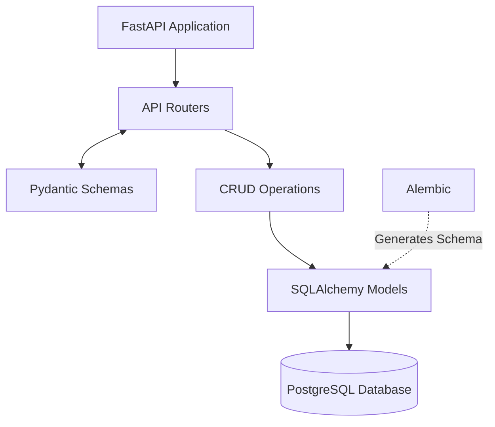

# Project Overview
We are building a microservice (REST API) from scratch for a personal habit and activity tracker. 

## Technology Stack
- **Framework:** FastAPI (asynchronous)
- **Database:** PostgreSQL
- **ORM:** SQLAlchemy 2.0 (async)
- **Migrations:** Alembic
- **Validation:** Pydantic
- **Deployment:** Docker + docker-compose

## Business Logic & Entities
We have two main tables in the database:
1. `Activity`: A dictionary of activities. Fields: `id`, `name`, `unit`, `created_at`.
2. `Log`: The activity journal. Fields: `id`, `activity_id` (FK), `amount`, `date`, `notes`, `created_at`.

## Required Endpoints
- `POST /activities/` — create a new activity.
- `GET /activities/` — get a list of all activities.
- `POST /logs/` — add an entry to the journal.
- `GET /logs/summary` — get aggregated statistics for the last 7 days (sum of amount grouped by activity_id).

## Directory Structure Strategy
> **Strict Rule:** Do not deviate from this structure without asking for permission.

habit_tracker/
├── app/
│   ├── main.py
│   ├── api/
│   │   ├── deps.py
│   │   ├── router.py
│   │   └── routers/        # one module per resource
│   ├── core/
│   ├── crud/
│   ├── db/
│   ├── models/
│   └── schemas/
├── bot/                    # aiogram Telegram client (own Dockerfile + requirements)
│   ├── __main__.py
│   ├── client.py
│   ├── handlers/           # one module per flow
│   └── ...
├── alembic/
├── alembic.ini
├── .env
├── .env.example
├── docker-compose.yml
├── Dockerfile
├── entrypoint.sh
└── requirements.txt

## Development Guidelines for Claude Code
Always plan first: Use the /goal command or planning mode before generating large chunks of code.

Strict Typing: All Python code must have strict type hints (PEP 484).

Async Everything: Ensure SQLAlchemy queries and FastAPI endpoints use async/await.

No Hallucinations: Use the postgres MCP server to check the actual schema if you are unsure about database fields.

Updates: If we make an architectural decision during our chat, update this CLAUDE.md file to reflect it.

## Code Requirements:

Strict typing (Type hints).

Clean architecture (separation into routers, models, schemas, database, crud).

Adherence to OOP principles and PEP8 standards.

## Architectural Diagram


## Decisions Log (2026-08-11, initial build)

- **Summary window:** `/logs/summary` covers `today - 6 days .. today` inclusive — 7 calendar days *including* today. Overridable per request via the `?days=` query param (1–365), default from `settings.summary_window_days`.
- **Summary payload:** joins `activity_name` and `unit` alongside `activity_id`, plus `total_amount` and `entries_count`. Wrapped in `SummaryResponse`, which also reports `period_start` / `period_end` / `days`. Aggregation runs in PostgreSQL (`SUM`/`COUNT` + `GROUP BY`), never in Python.
- **Summary ordering:** `ORDER BY SUM(amount) DESC, activity_id ASC` — busiest activity first, with `activity_id` ascending as the tiebreaker. The tiebreaker is required: `SUM` alone leaves rows with equal totals in whatever order PostgreSQL returns them, which is not stable across requests. Any future summary-style aggregation must likewise end its `ORDER BY` on a unique column.
- **`Log.amount`:** `Numeric(10, 2)` → Python `Decimal`, not `float`, to avoid rounding drift when summing.
- **`Activity.name`:** unique + indexed. `POST /activities/` returns **409** on a duplicate name.
- **`POST /logs/`:** validates the FK first and returns **404** if `activity_id` does not exist. `date` defaults to today when omitted.
- **Route ordering:** `GET /logs/summary` is declared before any future `/logs/{id}` route so `summary` is never parsed as an id.
- **Indexes:** `logs(activity_id)`, `logs(date)`, and a composite `logs(activity_id, date)` matching the summary query's filter + grouping.
- **Sessions:** one `AsyncSession` per request via `get_session`, committing on success and rolling back on exception. CRUD methods `flush`, never `commit`.
- **Alembic:** async template; `alembic.ini` leaves `sqlalchemy.url` blank and `alembic/env.py` sources it from `app.core.config.settings`. Baseline revision `0001_initial`.
- **Docker:** `python:3.12-slim` (not 3.14 — wider wheel availability), non-root `appuser`. `entrypoint.sh` runs `alembic upgrade head` before uvicorn. Compose publishes `5432:5432` so the postgres MCP server can reach the DB from the host.
- **Tests:** deliberately deferred; no `tests/` package yet.

### Files added beyond the tree above (approved)
`alembic.ini`, `entrypoint.sh`, `.env.example`, `app/api/routers/`, `app/db/{base,session}.py`, `app/crud/base.py`, and `__init__.py` per package.

### Local commands
```bash
.venv/bin/uvicorn app.main:app --reload   # API on :8000, docs at /docs
.venv/bin/alembic upgrade head            # apply migrations
docker compose up --build                 # full stack (needs Docker installed)
```
## Telegram Bot Architecture
- **Framework:** `aiogram` (v3.x) for fully asynchronous Telegram integration.
- **Deployment:** Run as a separate, isolated container in `docker-compose.yml` (e.g., `bot` service).
- **Integration:** The bot must act strictly as an external client. It is forbidden from connecting to the PostgreSQL database directly. All data must be fetched and sent via asynchronous HTTP requests (`httpx`) to the FastAPI backend.
- **UX:** Utilize Telegram Inline Keyboards for logging activities and requesting summaries to minimize manual typing.

## Decisions Log (2026-08-11, multi-tenancy + Telegram bot)

### Multi-tenancy
- **Why now:** the bot makes the API multi-user by definition. Before this change `activities.name` was globally unique and `/logs/summary` aggregated the whole table, so a second Telegram account would have shared one journal with the first and collided on names.
- **Tenant identification:** every request carries `X-Telegram-Id` plus a shared secret `X-Internal-Api-Key` (`settings.internal_api_key`, no default — the API refuses to boot unconfigured). `get_current_user` in `app/api/deps.py` compares the key with `secrets.compare_digest`, returns **401** on mismatch, and then resolves the tenant. Missing or malformed headers fall through to FastAPI's own **422**. URLs are unchanged — the tenant is never in the path.
- **User provisioning:** first contact creates the row; there is no registration endpoint. `user_crud.get_or_create` looks the user up with a plain `SELECT` and returns early, falling through to PostgreSQL `INSERT ... ON CONFLICT (telegram_id) DO UPDATE` only on first contact — so two concurrent first messages still cannot race into a duplicate-key error, while the settled case (every authenticated request) neither burns a sequence value nor writes a new row version.
- **`username is None` means absent, not cleared:** a caller that omits `X-Telegram-Username` is not asserting the account has no username. `get_or_create` therefore leaves the stored value alone on both paths — an `is not None` guard before the early-return update, and `COALESCE(EXCLUDED.username, users.username)` in the upsert. Otherwise one header-less `curl` would blank a name the bot had already stored. The trade-off is that clearing a username is not expressible; that is accepted, because no caller can currently distinguish a dropped Telegram `@name` from a header it simply failed to send.
- **`User.telegram_id`:** `BigInteger` — Telegram ids already exceed 32 bits. Unique + indexed.
- **`Activity` ownership:** `user_id` FK with `ON DELETE CASCADE`. The global unique index on `name` is replaced by `uq_activities_user_id_name` — two users may each own a "Running". `name` keeps a plain (non-unique) index.
- **`Log` is *not* denormalised:** it has no `user_id`. Ownership is derived through `logs.activity_id → activities.user_id`, and the summary query already joined `activities` for the name and unit, so scoping is free and there is no second copy of the owner to drift.
- **Cross-tenant reads:** `activity_crud.get_for_user` returns `None` for somebody else's row, and `POST /logs/` reports it with the same **404** as a nonexistent id — the response never confirms the activity exists.
- **`CRUDBase.get` / `get_multi` are tenant-blind** and must not be used for activities or logs. Use the scoped subclass methods (`get_multi_for_user`, `get_for_user`, `get_by_name(user_id=...)`). Any future entity that belongs to a user follows the same rule.
- **Summary ordering is unchanged:** `ORDER BY SUM(amount) DESC, activity_id ASC`, per the earlier decision.
- **Migration `0002_multi_tenancy`:** hand-written, not autogenerated. Adds `user_id` nullable, adopts any pre-existing activities into a bootstrap user (`telegram_id = 0`, created only if there is something to adopt), then sets `NOT NULL`. Runs against both an empty and a populated database. `downgrade()` keeps a single owner's activities, since a global unique `name` cannot survive two owners.

### Telegram bot
- **`bot/` is an approved top-level package** — a deviation from the directory rule, agreed because a separate image with its own `requirements.txt` means `asyncpg`/SQLAlchemy are never installed alongside the bot. The "no direct DB access" rule is enforced by the image, not by discipline. `bot/` must never import from `app/`.
- **Transport:** long polling, not webhooks — no public URL or TLS termination needed.
- **HTTP client:** one process-wide `httpx.AsyncClient` built in `bot/__main__.py` and injected via `dispatcher["api"]` (aiogram passes matching workflow-data keys as handler kwargs). Never one client per update. The shared secret is a client-level header; the tenant headers are per call.
- **Error handling:** `bot/client.py` funnels every failure into `ApiError`; `status_code=None` means the request never reached the API. Handlers branch on the status code and never see httpx.
- **Amounts cross JSON as strings** (`str(amount)`), not floats — a float round-trip would reintroduce the drift `Numeric(10, 2)` exists to prevent. `bot/formatting.parse_amount` mirrors the API's validation envelope client-side so a bad value gets a sentence, not a 422.
- **Callback data:** aiogram `CallbackData` factories, never hand-formatted strings. Telegram's 64-byte cap means ids, not names.
- **FSM:** `MemoryStorage`. A restart drops half-finished flows, which is acceptable because nothing is written until a flow completes. `common.router` is registered first so `/cancel` wins over state-bound message handlers.
- **Onboarding:** no seeded activities. A new user's `/log` shows an empty state with a "➕ New activity" button leading into the same `/new` flow.
- **Compose:** the `api` service gained a `/health` healthcheck (via `python -c urllib.request`, as the slim image has no `curl`) and `bot` waits on `service_healthy`, so the first `/log` never hits a container still running migrations. `INTERNAL_API_KEY` and `TELEGRAM_BOT_TOKEN` are required — compose fails fast if they are unset.

## Decisions Log (2026-08-11, editing and deleting entries — `/history`)

### Backend
- **No migration.** Editing and deleting journal rows needs no schema change. Deleting a log never touches its activity; the `ON DELETE CASCADE` on `logs.activity_id` only ever runs in the other direction.
- **`GET /logs/`:** paged (`limit` 1–50 default 10, `offset` ≥ 0), ordered `date DESC, id DESC`. The `id` tiebreaker is mandatory for the same reason as in the summary, but with teeth here: entries routinely share a date, and without it a paged read can show one row twice and skip another. Rows are joined onto `activities` and returned as `LogListItem` carrying `activity_name` and `unit`, because the join is needed for scoping anyway and it spares every client an N+1.
- **`PATCH /logs/{log_id}` edits `amount` only.** `LogUpdate` sets `extra="forbid"`, so a body containing `activity_id` is a **422 rather than a silent no-op** — re-parenting an entry is a different operation needing its own ownership check on the target, and quietly ignoring the field would let a caller believe it had moved one.
- **`DELETE /logs/{log_id}` returns 204** and removes only the journal row.
- **Scoping:** both mutations resolve the row through `log_crud.get_for_user`, a single `SELECT ... JOIN activities WHERE logs.id = :id AND activities.user_id = :uid` — the join *is* the ownership check, not a separate step afterwards. Another user's entry yields **404** with the identical wording used for an id that never existed. Never 403: a 403 confirms the row is out there.
- **`CRUDBase.update` / `remove` take an instance, never an id.** Deleting by id would require a lookup, and the only one available on the base class is the tenant-blind `get` — which would hand over another user's row. Requiring an already-fetched instance makes ownership structurally unskippable rather than a rule to remember. Any future mutation helper follows this.
- **Route ordering:** the `/{log_id}` routes are declared *after* `GET /logs/summary`, or `summary` would be parsed as a log id. This is the pre-existing rule, and this change is exactly the one that could have broken it.

### Bot
- **`/history`** lists 10 entries a page, newest first, one button per row; tapping opens a detail view offering *Edit amount* and *Delete*. Only entries are reachable — deleting an activity is not offered anywhere in the flow, and the delete prompt says so.
- **Paging asks for `PAGE_SIZE + 1`** and renders the first `PAGE_SIZE`. The extra row answers "is there a next page" without a count endpoint or a second round trip.
- **Back is `HistoryPageCB(offset=…)`, not `NavCB(action="back")`.** `NavCB(action="back")` is already claimed by the `/log` flow, whose router is consulted first, so reusing it would have dropped the user into the activity picker. Doubling the pager as the back button also returns them to the page they came from.
- **`LogDeleteCB` carries a `confirm` flag** so the ask and the do share one factory and cannot drift apart. Deletion is irreversible and its button sits beside a far more common one, so the second tap is required.
- **Stale keyboards are assumed.** Old `/history` messages stay tappable forever, so every tap re-reads the page: that keeps what is shown honest and doubles as the ownership check, since the API only ever lists the caller's own entries. A 404 renders "that entry is already gone" and redraws rather than surfacing an error. A double-tapped delete lands there too — the entry is gone either way, which is what was asked for.
- **`HistoryStates.waiting_new_amount` is separate from `LogStates.waiting_amount`.** Both wait for a typed number; sharing a state would let the `/log` handler answer a message meant for an edit and write a *new* entry instead of amending the one in hand.
- **`_request` returns `None` for 204 / empty bodies.** It previously ended in `response.json()`, and only `httpx.RequestError` is funnelled into `ApiError` — so `DELETE` would have raised a `JSONDecodeError` straight past the error handling and out as an unhandled exception.
- **`edit_message` swallows "message is not modified".** Stepping Back out of an entry re-renders a byte-identical screen, which Telegram rejects outright. Only that one message is suppressed; any other `TelegramBadRequest` still raises.
