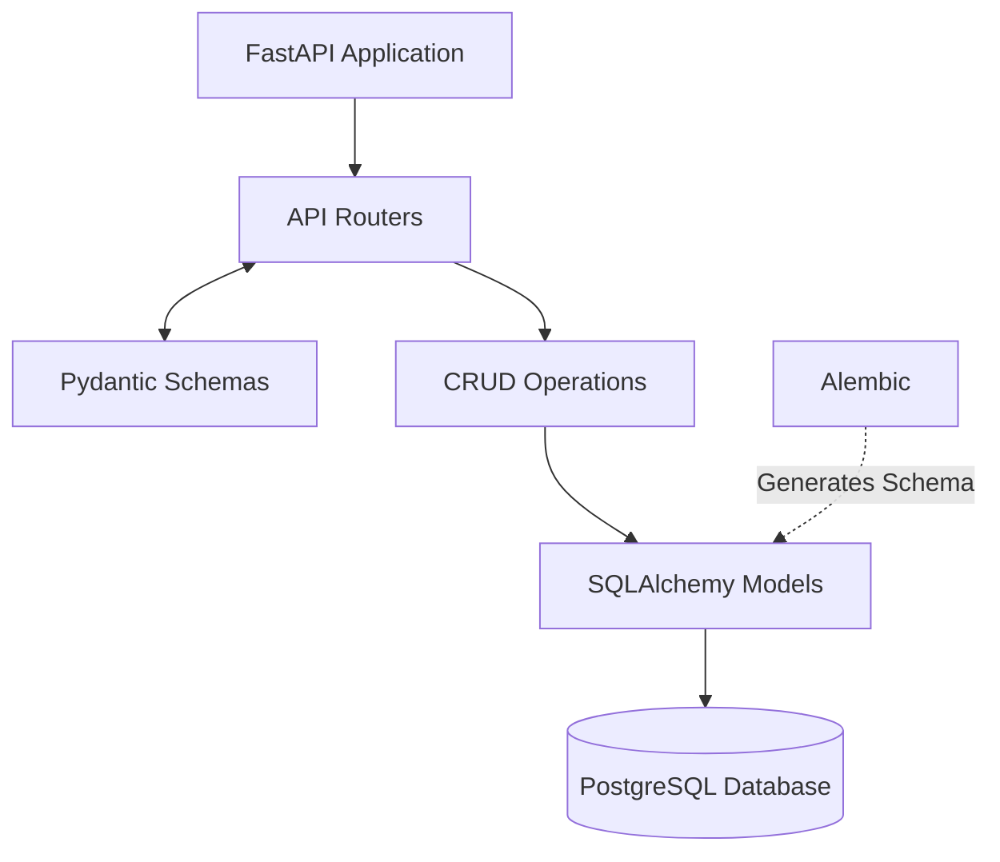

# Project Overview
We are building a microservice (REST API) from scratch for a personal habit and activity tracker. 

## Technology Stack
- **Framework:** FastAPI (asynchronous)
- **Database:** PostgreSQL
- **ORM:** SQLAlchemy 2.0 (async)
- **Migrations:** Alembic
- **Validation:** Pydantic
- **Deployment:** Docker + docker-compose

## Business Logic & Entities
We have two main tables in the database:
1. `Activity`: A dictionary of activities. Fields: `id`, `name`, `unit`, `created_at`.
2. `Log`: The activity journal. Fields: `id`, `activity_id` (FK), `amount`, `date`, `notes`, `created_at`.

## Required Endpoints
- `POST /activities` — create a new activity.
- `GET /activities` — get a list of all activities.
- `POST /logs` — add an entry to the journal.
- `GET /logs/summary` — get aggregated statistics for the last 7 days (sum of amount grouped by activity_id).

> **No trailing slashes on collection routes.** See the 2026-08-29 decisions log — a trailing slash is unroutable behind the AWS Lambda Function URL.

## Directory Structure Strategy
> **Strict Rule:** Do not deviate from this structure without asking for permission.

habit_tracker/
├── app/
│   ├── main.py
│   ├── api/
│   │   ├── deps.py
│   │   ├── router.py
│   │   └── routers/        # one module per resource
│   ├── core/
│   ├── crud/
│   ├── db/
│   ├── models/
│   └── schemas/
├── bot/                    # aiogram Telegram client (own Dockerfile + requirements)
│   ├── __main__.py
│   ├── client.py
│   ├── handlers/           # one module per flow
│   └── ...
├── alembic/
├── alembic.ini
├── .env
├── .env.example
├── docker-compose.yml
├── Dockerfile
├── entrypoint.sh
└── requirements.txt

## Development Guidelines for Claude Code
Always plan first: Use the /goal command or planning mode before generating large chunks of code.

Strict Typing: All Python code must have strict type hints (PEP 484).

Async Everything: Ensure SQLAlchemy queries and FastAPI endpoints use async/await.

No Hallucinations: Use the postgres MCP server to check the actual schema if you are unsure about database fields.

Updates: If we make an architectural decision during our chat, update this CLAUDE.md file to reflect it.

## Code Requirements:

Strict typing (Type hints).

Clean architecture (separation into routers, models, schemas, database, crud).

Adherence to OOP principles and PEP8 standards.

## Architectural Diagram


## Decisions Log (2026-08-11, initial build)

- **Summary window:** `/logs/summary` covers `today - 6 days .. today` inclusive — 7 calendar days *including* today. Overridable per request via the `?days=` query param (1–365), default from `settings.summary_window_days`.
- **Summary payload:** joins `activity_name` and `unit` alongside `activity_id`, plus `total_amount` and `entries_count`. Wrapped in `SummaryResponse`, which also reports `period_start` / `period_end` / `days`. Aggregation runs in PostgreSQL (`SUM`/`COUNT` + `GROUP BY`), never in Python.
- **Summary ordering:** `ORDER BY SUM(amount) DESC, activity_id ASC` — busiest activity first, with `activity_id` ascending as the tiebreaker. The tiebreaker is required: `SUM` alone leaves rows with equal totals in whatever order PostgreSQL returns them, which is not stable across requests. Any future summary-style aggregation must likewise end its `ORDER BY` on a unique column.
- **`Log.amount`:** `Numeric(10, 2)` → Python `Decimal`, not `float`, to avoid rounding drift when summing.
- **`Activity.name`:** unique + indexed. `POST /activities/` returns **409** on a duplicate name.
- **`POST /logs/`:** validates the FK first and returns **404** if `activity_id` does not exist. `date` defaults to today when omitted.
- **Route ordering:** `GET /logs/summary` is declared before any future `/logs/{id}` route so `summary` is never parsed as an id.
- **Indexes:** `logs(activity_id)`, `logs(date)`, and a composite `logs(activity_id, date)` matching the summary query's filter + grouping.
- **Sessions:** one `AsyncSession` per request via `get_session`, committing on success and rolling back on exception. CRUD methods `flush`, never `commit`.
- **Alembic:** async template; `alembic.ini` leaves `sqlalchemy.url` blank and `alembic/env.py` sources it from `app.core.config.settings`. Baseline revision `0001_initial`.
- **Docker:** `python:3.12-slim` (not 3.14 — wider wheel availability), non-root `appuser`. `entrypoint.sh` runs `alembic upgrade head` before uvicorn. Compose publishes `5432:5432` so the postgres MCP server can reach the DB from the host.
- **Tests:** deliberately deferred; no `tests/` package yet.

### Files added beyond the tree above (approved)
`alembic.ini`, `entrypoint.sh`, `.env.example`, `app/api/routers/`, `app/db/{base,session}.py`, `app/crud/base.py`, and `__init__.py` per package.

### Local commands
```bash
.venv/bin/uvicorn app.main:app --reload   # API on :8000, docs at /docs
.venv/bin/alembic upgrade head            # apply migrations
docker compose up --build                 # full stack (needs Docker installed)
```
## Telegram Bot Architecture
- **Framework:** `aiogram` (v3.x) for fully asynchronous Telegram integration.
- **Deployment:** Run as a separate, isolated container in `docker-compose.yml` (e.g., `bot` service).
- **Integration:** The bot must act strictly as an external client. It is forbidden from connecting to the PostgreSQL database directly. All data must be fetched and sent via asynchronous HTTP requests (`httpx`) to the FastAPI backend.
- **UX:** Utilize Telegram Inline Keyboards for logging activities and requesting summaries to minimize manual typing.

## Decisions Log (2026-08-11, multi-tenancy + Telegram bot)

### Multi-tenancy
- **Why now:** the bot makes the API multi-user by definition. Before this change `activities.name` was globally unique and `/logs/summary` aggregated the whole table, so a second Telegram account would have shared one journal with the first and collided on names.
- **Tenant identification:** every request carries `X-Telegram-Id` plus a shared secret `X-Internal-Api-Key` (`settings.internal_api_key`, no default — the API refuses to boot unconfigured). `get_current_user` in `app/api/deps.py` compares the key with `secrets.compare_digest`, returns **401** on mismatch, and then resolves the tenant. Missing or malformed headers fall through to FastAPI's own **422**. URLs are unchanged — the tenant is never in the path.
- **User provisioning:** first contact creates the row; there is no registration endpoint. `user_crud.get_or_create` looks the user up with a plain `SELECT` and returns early, falling through to PostgreSQL `INSERT ... ON CONFLICT (telegram_id) DO UPDATE` only on first contact — so two concurrent first messages still cannot race into a duplicate-key error, while the settled case (every authenticated request) neither burns a sequence value nor writes a new row version.
- **`username is None` means absent, not cleared:** a caller that omits `X-Telegram-Username` is not asserting the account has no username. `get_or_create` therefore leaves the stored value alone on both paths — an `is not None` guard before the early-return update, and `COALESCE(EXCLUDED.username, users.username)` in the upsert. Otherwise one header-less `curl` would blank a name the bot had already stored. The trade-off is that clearing a username is not expressible; that is accepted, because no caller can currently distinguish a dropped Telegram `@name` from a header it simply failed to send.
- **`User.telegram_id`:** `BigInteger` — Telegram ids already exceed 32 bits. Unique + indexed.
- **`Activity` ownership:** `user_id` FK with `ON DELETE CASCADE`. The global unique index on `name` is replaced by `uq_activities_user_id_name` — two users may each own a "Running". `name` keeps a plain (non-unique) index.
- **`Log` is *not* denormalised:** it has no `user_id`. Ownership is derived through `logs.activity_id → activities.user_id`, and the summary query already joined `activities` for the name and unit, so scoping is free and there is no second copy of the owner to drift.
- **Cross-tenant reads:** `activity_crud.get_for_user` returns `None` for somebody else's row, and `POST /logs/` reports it with the same **404** as a nonexistent id — the response never confirms the activity exists.
- **`CRUDBase.get` / `get_multi` are tenant-blind** and must not be used for activities or logs. Use the scoped subclass methods (`get_multi_for_user`, `get_for_user`, `get_by_name(user_id=...)`). Any future entity that belongs to a user follows the same rule.
- **Summary ordering is unchanged:** `ORDER BY SUM(amount) DESC, activity_id ASC`, per the earlier decision.
- **Migration `0002_multi_tenancy`:** hand-written, not autogenerated. Adds `user_id` nullable, adopts any pre-existing activities into a bootstrap user (`telegram_id = 0`, created only if there is something to adopt), then sets `NOT NULL`. Runs against both an empty and a populated database. `downgrade()` keeps a single owner's activities, since a global unique `name` cannot survive two owners.

### Telegram bot
- **`bot/` is an approved top-level package** — a deviation from the directory rule, agreed because a separate image with its own `requirements.txt` means `asyncpg`/SQLAlchemy are never installed alongside the bot. The "no direct DB access" rule is enforced by the image, not by discipline. `bot/` must never import from `app/`.
- **Transport:** long polling, not webhooks — no public URL or TLS termination needed.
- **HTTP client:** one process-wide `httpx.AsyncClient` built in `bot/__main__.py` and injected via `dispatcher["api"]` (aiogram passes matching workflow-data keys as handler kwargs). Never one client per update. The shared secret is a client-level header; the tenant headers are per call.
- **Error handling:** `bot/client.py` funnels every failure into `ApiError`; `status_code=None` means the request never reached the API. Handlers branch on the status code and never see httpx.
- **Amounts cross JSON as strings** (`str(amount)`), not floats — a float round-trip would reintroduce the drift `Numeric(10, 2)` exists to prevent. `bot/formatting.parse_amount` mirrors the API's validation envelope client-side so a bad value gets a sentence, not a 422.
- **Callback data:** aiogram `CallbackData` factories, never hand-formatted strings. Telegram's 64-byte cap means ids, not names.
- **FSM:** `MemoryStorage`. A restart drops half-finished flows, which is acceptable because nothing is written until a flow completes. `common.router` is registered first so `/cancel` wins over state-bound message handlers.
- **Onboarding:** no seeded activities. A new user's `/log` shows an empty state with a "➕ New activity" button leading into the same `/new` flow.
- **Compose:** the `api` service gained a `/health` healthcheck (via `python -c urllib.request`, as the slim image has no `curl`) and `bot` waits on `service_healthy`, so the first `/log` never hits a container still running migrations. `INTERNAL_API_KEY` and `TELEGRAM_BOT_TOKEN` are required — compose fails fast if they are unset.

## Decisions Log (2026-08-11, editing and deleting entries — `/history`)

### Backend
- **No migration.** Editing and deleting journal rows needs no schema change. Deleting a log never touches its activity; the `ON DELETE CASCADE` on `logs.activity_id` only ever runs in the other direction.
- **`GET /logs/`:** paged (`limit` 1–50 default 10, `offset` ≥ 0), ordered `date DESC, id DESC`. The `id` tiebreaker is mandatory for the same reason as in the summary, but with teeth here: entries routinely share a date, and without it a paged read can show one row twice and skip another. Rows are joined onto `activities` and returned as `LogListItem` carrying `activity_name` and `unit`, because the join is needed for scoping anyway and it spares every client an N+1.
- **`PATCH /logs/{log_id}` edits `amount` only.** `LogUpdate` sets `extra="forbid"`, so a body containing `activity_id` is a **422 rather than a silent no-op** — re-parenting an entry is a different operation needing its own ownership check on the target, and quietly ignoring the field would let a caller believe it had moved one.
- **`DELETE /logs/{log_id}` returns 204** and removes only the journal row.
- **Scoping:** both mutations resolve the row through `log_crud.get_for_user`, a single `SELECT ... JOIN activities WHERE logs.id = :id AND activities.user_id = :uid` — the join *is* the ownership check, not a separate step afterwards. Another user's entry yields **404** with the identical wording used for an id that never existed. Never 403: a 403 confirms the row is out there.
- **`CRUDBase.update` / `remove` take an instance, never an id.** Deleting by id would require a lookup, and the only one available on the base class is the tenant-blind `get` — which would hand over another user's row. Requiring an already-fetched instance makes ownership structurally unskippable rather than a rule to remember. Any future mutation helper follows this.
- **Route ordering:** the `/{log_id}` routes are declared *after* `GET /logs/summary`, or `summary` would be parsed as a log id. This is the pre-existing rule, and this change is exactly the one that could have broken it.

### Bot
- **`/history`** lists 10 entries a page, newest first, one button per row; tapping opens a detail view offering *Edit amount* and *Delete*. Only entries are reachable — deleting an activity is not offered anywhere in the flow, and the delete prompt says so.
- **Paging asks for `PAGE_SIZE + 1`** and renders the first `PAGE_SIZE`. The extra row answers "is there a next page" without a count endpoint or a second round trip.
- **Back is `HistoryPageCB(offset=…)`, not `NavCB(action="back")`.** `NavCB(action="back")` is already claimed by the `/log` flow, whose router is consulted first, so reusing it would have dropped the user into the activity picker. Doubling the pager as the back button also returns them to the page they came from.
- **`LogDeleteCB` carries a `confirm` flag** so the ask and the do share one factory and cannot drift apart. Deletion is irreversible and its button sits beside a far more common one, so the second tap is required.
- **Stale keyboards are assumed.** Old `/history` messages stay tappable forever, so every tap re-reads the page: that keeps what is shown honest and doubles as the ownership check, since the API only ever lists the caller's own entries. A 404 renders "that entry is already gone" and redraws rather than surfacing an error. A double-tapped delete lands there too — the entry is gone either way, which is what was asked for.
- **`HistoryStates.waiting_new_amount` is separate from `LogStates.waiting_amount`.** Both wait for a typed number; sharing a state would let the `/log` handler answer a message meant for an edit and write a *new* entry instead of amending the one in hand.
- **`_request` returns `None` for 204 / empty bodies.** It previously ended in `response.json()`, and only `httpx.RequestError` is funnelled into `ApiError` — so `DELETE` would have raised a `JSONDecodeError` straight past the error handling and out as an unhandled exception.
- **`edit_message` swallows "message is not modified".** Stepping Back out of an entry re-renders a byte-identical screen, which Telegram rejects outright. Only that one message is suppressed; any other `TelegramBadRequest` still raises.

## Decisions Log (2026-08-29, AWS Lambda deployment)

- **Telegram webhook URL must include the path.** `setWebhook` was registered against the bare Function URL, so every update hit `POST /` — a route that does not exist — and the Lambda returned 404 in ~3 ms without ever reaching aiogram. The registered URL must be `https://<function-url>/webhook`, matching `@router.post("/webhook")` in `bot/webhook.py`. Verify with `getWebhookInfo`: a healthy webhook reports no `last_error_message` and drains `pending_update_count` to 0.
- **Collection routes are declared as `""`, never `"/"`.** Behind the Lambda Function URL, trailing slashes are stripped before the request reaches Starlette — verified on the live deployment, where `GET /health/` and even `GET /health//` return 200 instead of the redirect Starlette would normally issue. With the routes declared as `"/"`, `GET /activities/` arrived as `/activities`, matched nothing, and Starlette's `redirect_slashes` answered 307 pointing back at `/activities/` — which was stripped again. An infinite redirect loop.
  - **Why it surfaced as "backend unreachable":** the bot client sets `follow_redirects=True`, so httpx walked the loop until `max_redirects` and raised `httpx.TooManyRedirects`. That is a subclass of `httpx.RequestError`, so it was funnelled into `ApiError(status_code=None)` — the branch `describe_api_error` renders as "The tracker backend is unreachable right now."
  - **How to apply:** any future collection endpoint uses `@router.get("")` under a prefix, and `bot/client.py` requests it without a trailing slash. Endpoints that already carry a path segment (`/logs/summary`, `/logs/{log_id}`, `/webhook`) are unaffected.
- **Never call `response.raise_for_status()` in `bot/client.py`.** It raises `httpx.HTTPStatusError`, which is *not* a subclass of `httpx.RequestError` and therefore escapes the `except` that funnels failures into `ApiError` — surfacing to handlers as an unhandled exception. It also made the `if response.is_error:` block below it dead code, so deliberate API errors (409 on a duplicate name, 404 on a missing entry) lost their friendly wording. The `_request` error handling is deliberate; leave it alone.
- **Deploying is not automatic.** These are code changes: the Lambda keeps serving the old image until it is rebuilt from `Dockerfile.lambda`, pushed to ECR, and the function updated.

## Decisions Log (2026-09-22, React frontend — stack selected)

### Stack
- **Build tool / framework:** React via **Vite** (SPA, not Next.js — the server is FastAPI and there is no SSR requirement).
- **State:** **Zustand**.
- **Charts:** **Recharts** — this is what `/logs/summary` exists to feed.
- **Routing:** **React Router**, *declarative mode* (`BrowserRouter` + JSX routes). Framework mode and data mode are both rejected: they move data loading into React Router's own server/loader layer, and this project's server is FastAPI. Routes stay JSX; fetching stays in components/stores.

### Agent skills installed
Installed with `npx skills add`, which writes to `.agents/skills/<name>/` and symlinks each into `.claude/skills/`. A `skills-lock.json` at the repo root records the pinned versions.

| Skill | Source | Covers |
| --- | --- | --- |
| `vercel-react-best-practices` | `vercel-labs/agent-skills` (official Vercel) | React render/bundle performance, 70 rules |
| `zustand-state-management` | `Mindrally/skills` | store design, selector re-renders, persist/devtools/immer, testing |
| `react-router-declarative-mode` | `remix-run/agent-skills` (official React Router) | `BrowserRouter`, `Link`/`NavLink`, URL and search params |

- **Recharts has no dedicated skill worth installing.** Checked `anthropics/skills`, `vercel-labs/agent-skills`, `Mindrally/skills` (265 skills, zero Recharts hits) and `existential-birds/beagle`. The `dataviz` skill that ships with Claude Code already names Recharts explicitly and loads on its own for any chart work, so nothing was added.
- **Skill directories are committed, not ignored.** `.agents/skills/` and `.claude/skills/` are checked in so the guidance travels with the repo rather than depending on each machine running the installer.

### Constraints the frontend inherits from the API
- **No trailing slashes on collection routes** — `GET /activities`, `POST /logs`. See the 2026-08-29 entry; a trailing slash is unroutable behind the Lambda Function URL.
- **Amounts cross JSON as strings**, never floats. `Log.amount` is `Numeric(10, 2)`; a float round-trip reintroduces exactly the drift that column exists to prevent. Parse to a decimal-safe type client-side, and send `String(amount)`.
- **`GET /logs` is paged** (`limit` 1–50 default 10, `offset`) and already returns `activity_name` and `unit` per row, so the frontend must not N+1 back to `/activities`.

### Authentication — resolved (two paths, no session cookies)

**Mini App (primary path).** The React SPA reads `window.Telegram.WebApp.initData` and sends it in the `Authorization` header. FastAPI validates the HMAC-SHA-256 signature with the bot token: the secret key is `HMAC_SHA256(key="WebAppData", msg=<bot token>)`, and the `hash` field is checked against a digest over the remaining fields sorted by key and joined with newlines. Reject a stale `auth_date`. The **verified** `user.id` out of `initData` is what identifies the tenant — the browser never asserts its own identity the way the `X-Telegram-Id` header does.

- **The API already held the bot token, transitively.** `app/main.py` imports `bot.webhook`, which constructs `Bot(token=BotSettings().telegram_bot_token)` at *import* time — so the API process has always needed it and would crash on boot without it. `telegram_bot_token` is now a field on `app.core.config.Settings` too, with no default: sourcing an API secret through the bot's settings class was an accident waiting to be untangled. (An earlier revision of this file claimed the API had no access to the token. That was wrong.)
- **The bot's header auth is not replaced.** `bot/client.py` keeps sending `X-Telegram-Id` + `X-Internal-Api-Key`, which is safe because it runs server-side in its own container. So `get_current_user` must come to accept **both** schemes, not swap one for the other.

**Smart TV / standalone browser.** The QR-code short-polling flow: the TV polls the backend for its pending session, the phone — already authenticated by `initData` — approves that session, and the backend then issues a standard **JWT** to the TV.

- **Session cookies are rejected outright**, for both paths.
- **This flow is not specified in this repo yet.** There is no QR, JWT, polling or session code anywhere in `app/`, and no written design for it. Endpoint shapes, token lifetime, polling interval, session expiry and the QR payload all still need to be written down here before anything is implemented.

### Directory placement — `frontend/` is approved
`frontend/` is an approved top-level directory — the third documented deviation from the strict structure, after `bot/` and `alembic/`.

**Why:** it is an independent Vite project with its own `package.json`, its own toolchain, and its own deploy target — **Vercel**, separate from the Lambda that serves the API. Nesting it under `app/` would imply Python packaging and a shared build, and it has neither. This is the same reasoning that earned `bot/` its own directory and image: the boundary is enforced by the build, not by discipline.

**How to apply:** `frontend/` reaches the API only over HTTP, exactly as `bot/` does. It must never import from `app/`, and the Python tooling — `alembic`, the Docker builds, `requirements.txt` — must never reach into it. The repo stays a monorepo with two deploy targets.


## Decisions Log (2026-09-22, implementation — backend for the SPA)

Built in the order below; each step was verified against a real PostgreSQL 16 container before the next began.

### Daily buckets on `/logs/summary`
- **Grouped on `Log.date`, never `func.date(created_at)`.** `logs` carries both columns and they mean different things: `date` is the day an entry is *for* (user-settable, defaults to today), `created_at` is when the row was inserted. Grouping on `created_at` silently misfiles every backdated entry, and because it is `TIMESTAMPTZ` the truncation happens in the session timezone — UTC on Lambda — so a late-evening entry lands on the following day. `Log.date` is also the column `ix_logs_activity_id_date` already covers; `created_at` would need a new expression index. **Verified:** an entry dated three days back appears on that day's bucket, not today's.
- **Zero-filling in Python is not a violation of the aggregate-in-SQL rule.** The `SUM` and `GROUP BY` still run in PostgreSQL. Padding the days that returned no rows is shaping a response, not aggregating one. Two queries serve the whole payload — totals and daily — which is O(1) in the number of activities and therefore not an N+1.
- **Shape:** each `items[]` entry carries `weekly_stats: [{date, label, value}]`, exactly `days` long. `value` is a `Decimal`, so Pydantic emits it as a JSON **string**; a float would reintroduce the drift `Numeric(10, 2)` exists to prevent. There is deliberately **no top-level array** — summing across activities would add kilometres to repetitions.
- **Capped at 31 days.** `days` accepts up to 365 and buckets at that size are a payload problem, so `weekly_stats` is empty above the cap.
- `/logs/summary` still inner-joins `logs`, so a habit with no entries has no row. **The client must left-join `GET /activities` onto it**, or a newly created habit is invisible until its first entry.

### Authentication — two schemes, no fallback
- `get_current_user` branches on the **presence of `Authorization`** and never falls back between schemes. A rejected `initData` must not be retryable as header auth, or the weaker path becomes a bypass for the stronger one. **Verified:** bad `initData` sent alongside valid bot headers is a 401, not a 200.
- **`Authorization: tma <initData>`** requires the explicit scheme token. A bare payload was considered and rejected: it cannot be told apart from `Bearer` without guessing.
- **Behaviour change:** a request with no credentials at all was a 422 (both headers were required by FastAPI's own validation) and is now a **401**. A non-numeric `X-Telegram-Id` is still a 422.
- **One wording for every `initData` failure.** Forged, malformed and stale all return "Invalid Telegram credentials." Distinguishing them tells an attacker which half to keep working on.
- The bot's `X-Telegram-Id` + `X-Internal-Api-Key` path is untouched and must stay that way — it runs server-side in its own container, which is why it may hold a shared secret at all.

### QR login
- **Dependency: `pyjwt`.** Chosen over python-jose (effectively unmaintained, CVE history) and Authlib (drags in `cryptography`): HS256 in PyJWT needs no C extension, so `Dockerfile.lambda` stays free of manylinux/arm64 wheel surprises.
- **`expired` is a computed state, never a written one.** Lambda runs no scheduler, so nothing could write it at the moment it becomes true. Every query filters `expires_at > now()`, evaluated against the *database* clock.
- **The only garbage collection is a janitor at the top of `POST /qr-auth/init`.** There is no cron; do not go looking for one.
- **Approval and token pickup are conditional UPDATEs carrying their expected state in the WHERE clause**, with `RETURNING`. A read-then-write would let two Lambda containers both believe they won. **Verified:** five simultaneous polls against one approved session yielded exactly one token and four 404s.
- **Consumed reads as never-existed.** Replay, a guessed id and an expired session are all the same 404 with the same wording.
- **`sub` is the internal `user.id`.** The Telegram id is deliberately absent from the token — it would hand the account to anyone reading a shared TV's storage, and nothing downstream joins on it.
- **`jwt_secret` is separate from `internal_api_key`** and has no default. Rotating it is the *only* revocation mechanism; there is no deny list.
- **No global rate limit is possible in-process** — each Lambda invocation may be a fresh container, so `poll_count` bounds one session and nothing more. A real limit belongs at AWS WAF in front of the Function URL.
- **`values_callable` on the `status` column is load-bearing.** SQLAlchemy persists a Python enum by its *name* by default, which would have written `PENDING` while migration `0003` declares `pending`.

### Deployment notes
- `app.add_middleware(CORSMiddleware, ...)` reads a comma-separated `CORS_ORIGINS`. Never `*`: the SPA sends `Authorization`, so every request preflights.
- `TELEGRAM_BOT_TOKEN`, `JWT_SECRET`, `TELEGRAM_BOT_USERNAME` and `CORS_ORIGINS` are new required-or-recommended environment variables. `docker-compose.yml` now passes the bot token to the **api** service, which it never did despite `app/main.py` needing it at import time.
- **Lambda still does not run migrations.** `entrypoint.sh` does; `Dockerfile.lambda`'s `CMD` is the handler. Migration `0003` must be applied to the deployed database by hand.

## Decisions Log (2026-09-23, frontend auth gate + token persistence)

- **Unauthenticated browsers redirect to `/tv`, they do not fetch.** `RequireAuth` is a path-less gate route wrapping `/`, `/history`, `/habits/new` and `/scan`. Before it existed the dashboard mounted and called `/activities` with no credential, so a plain browser rendered the backend's `401 "Authentication required."` as though it were a failure — it is not a failure, the device just has not been logged in yet. `/tv` and the catch-all sit **outside** the gate; nesting `/tv` inside it would redirect to itself forever.
- **The gate reads the token through the Zustand hook, not `authHeader()`.** A plain function call does not re-render, so a device would stay stranded on `/tv` after a successful QR approval.
- **A "Web login" nav link appears outside Telegram**, mirroring the Telegram-only "Log in a TV" link. Without it `/tv` was reachable only by typing the URL.
- **The summary response is shape-checked where it enters the app**, in `joinHabits`, not guarded at each point of use. `HabitCard` walks `weeklyStats`, and the backend deliberately empties `weekly_stats` whenever `days > 31` — `undefined.map()` there unmounts the entire tree to a blank page. `items` is coerced for the same reason. This is the API boundary, which is where shapes get validated; scattering optional chaining through the components would leave the crash one new consumer away.
- **`ErrorBoundary` wraps the router outlet.** Without a boundary anywhere in the tree, any uncaught render error blanks the page with no way back.

### Token persistence — a deliberate reversal
- **The TV access token is now persisted to `localStorage`**, reversing the earlier decision to keep it in memory only. The in-memory store forced a fresh QR scan on **every page refresh**, which was judged worse than the exposure. Anything running on the origin can read the token, and on a shared living-room device it survives until it expires. Revisit if the token ever grants more than one account's habit data.
- `initData` is still never stored — Telegram reissues it on every launch.
- **Storage access is wrapped in try/catch with an in-memory fallback.** `localStorage` *throws* rather than returning null in a private window, with site data blocked, and inside some embedded webviews; an unguarded read in the persist middleware would kill the app before first paint. The fallback degrades to exactly the old behaviour.
- **Known gap:** a persisted token that has expired still satisfies the gate, so the dashboard shows a 401 error rather than redirecting to `/tv`. The "Web login" link is the escape hatch. Clearing the token automatically on a 401 would close this and has not been done.
