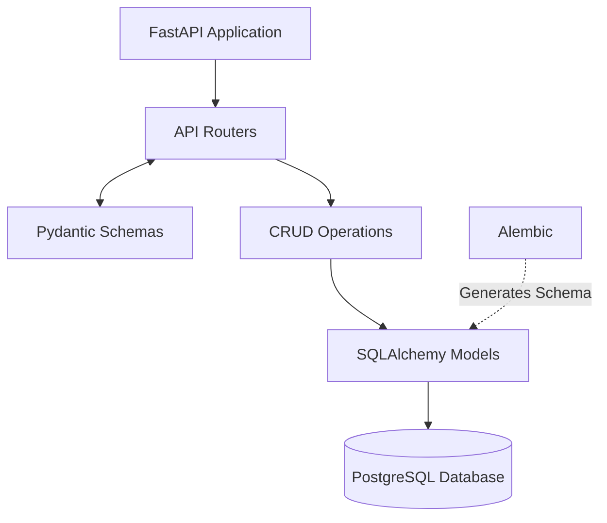

# Project Overview
We are building a microservice (REST API) from scratch for a personal habit and activity tracker. 

## Technology Stack
- **Framework:** FastAPI (asynchronous)
- **Database:** PostgreSQL
- **ORM:** SQLAlchemy 2.0 (async)
- **Migrations:** Alembic
- **Validation:** Pydantic
- **Deployment:** Docker + docker-compose

## Business Logic & Entities
We have two main tables in the database:
1. `Activity`: A dictionary of activities. Fields: `id`, `name`, `unit`, `created_at`.
2. `Log`: The activity journal. Fields: `id`, `activity_id` (FK), `amount`, `date`, `notes`, `created_at`.

## Required Endpoints
- `POST /activities/` — create a new activity.
- `GET /activities/` — get a list of all activities.
- `POST /logs/` — add an entry to the journal.
- `GET /logs/summary` — get aggregated statistics for the last 7 days (sum of amount grouped by activity_id).

## Directory Structure Strategy
> **Strict Rule:** Do not deviate from this structure without asking for permission.

habit_tracker/
├── app/
│   ├── main.py
│   ├── api/
│   │   ├── deps.py
│   │   ├── router.py
│   │   └── routers/        # one module per resource
│   ├── core/
│   ├── crud/
│   ├── db/
│   ├── models/
│   └── schemas/
├── alembic/
├── alembic.ini
├── .env
├── .env.example
├── docker-compose.yml
├── Dockerfile
├── entrypoint.sh
└── requirements.txt

## Development Guidelines for Claude Code
Always plan first: Use the /goal command or planning mode before generating large chunks of code.

Strict Typing: All Python code must have strict type hints (PEP 484).

Async Everything: Ensure SQLAlchemy queries and FastAPI endpoints use async/await.

No Hallucinations: Use the postgres MCP server to check the actual schema if you are unsure about database fields.

Updates: If we make an architectural decision during our chat, update this CLAUDE.md file to reflect it.

## Code Requirements:

Strict typing (Type hints).

Clean architecture (separation into routers, models, schemas, database, crud).

Adherence to OOP principles and PEP8 standards.

## Architectural Diagram


## Decisions Log (2026-08-11, initial build)

- **Summary window:** `/logs/summary` covers `today - 6 days .. today` inclusive — 7 calendar days *including* today. Overridable per request via the `?days=` query param (1–365), default from `settings.summary_window_days`.
- **Summary payload:** joins `activity_name` and `unit` alongside `activity_id`, plus `total_amount` and `entries_count`. Wrapped in `SummaryResponse`, which also reports `period_start` / `period_end` / `days`. Aggregation runs in PostgreSQL (`SUM`/`COUNT` + `GROUP BY`), never in Python.
- **`Log.amount`:** `Numeric(10, 2)` → Python `Decimal`, not `float`, to avoid rounding drift when summing.
- **`Activity.name`:** unique + indexed. `POST /activities/` returns **409** on a duplicate name.
- **`POST /logs/`:** validates the FK first and returns **404** if `activity_id` does not exist. `date` defaults to today when omitted.
- **Route ordering:** `GET /logs/summary` is declared before any future `/logs/{id}` route so `summary` is never parsed as an id.
- **Indexes:** `logs(activity_id)`, `logs(date)`, and a composite `logs(activity_id, date)` matching the summary query's filter + grouping.
- **Sessions:** one `AsyncSession` per request via `get_session`, committing on success and rolling back on exception. CRUD methods `flush`, never `commit`.
- **Alembic:** async template; `alembic.ini` leaves `sqlalchemy.url` blank and `alembic/env.py` sources it from `app.core.config.settings`. Baseline revision `0001_initial`.
- **Docker:** `python:3.12-slim` (not 3.14 — wider wheel availability), non-root `appuser`. `entrypoint.sh` runs `alembic upgrade head` before uvicorn. Compose publishes `5432:5432` so the postgres MCP server can reach the DB from the host.
- **Tests:** deliberately deferred; no `tests/` package yet.

### Files added beyond the tree above (approved)
`alembic.ini`, `entrypoint.sh`, `.env.example`, `app/api/routers/`, `app/db/{base,session}.py`, `app/crud/base.py`, and `__init__.py` per package.

### Local commands
```bash
.venv/bin/uvicorn app.main:app --reload   # API on :8000, docs at /docs
.venv/bin/alembic upgrade head            # apply migrations
docker compose up --build                 # full stack (needs Docker installed)
```

