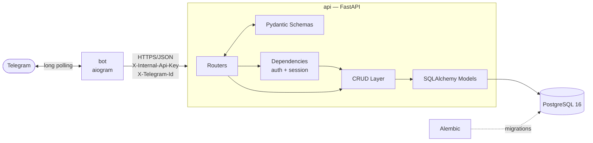
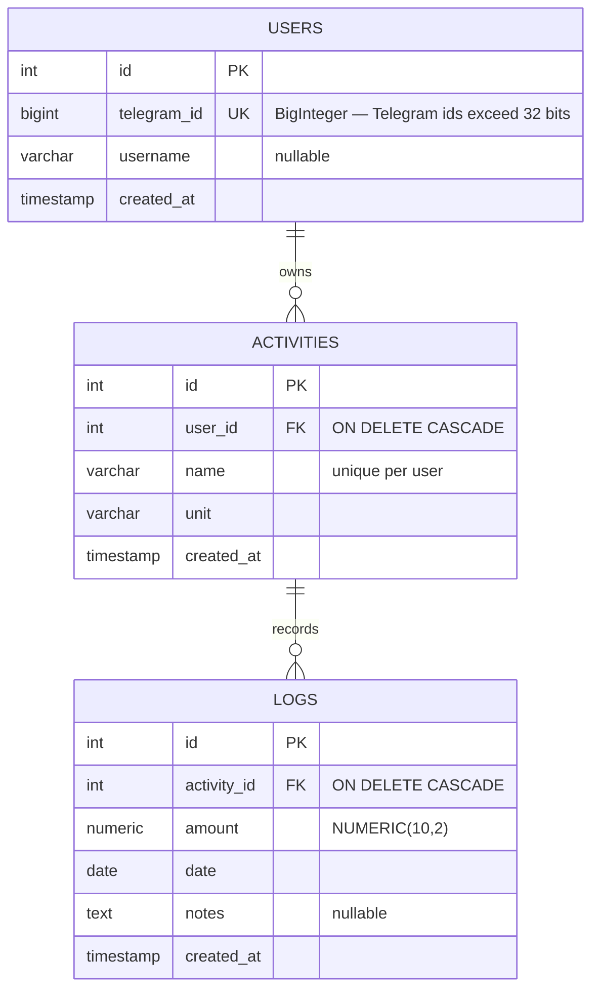

<div align="center">

# 🎯 Habit Tracker

**A personal habit and activity tracker — an async FastAPI microservice with a Telegram front end.**

Track anything you can put a number on. Log it from your phone in three taps.

[](https://www.python.org/)
[](https://fastapi.tiangolo.com/)
[](https://www.postgresql.org/)
[](https://www.sqlalchemy.org/)
[](https://aiogram.dev/)
[](https://docs.docker.com/compose/)

</div>

---

## Table of Contents

- [What it is](#what-it-is)
- [Features](#features)
- [Architecture](#architecture)
- [Tech Stack](#tech-stack)
- [Project Structure](#project-structure)
- [Environment Variables](#environment-variables)
- [Local Setup with Docker](#local-setup-with-docker)
- [Local Setup without Docker](#local-setup-without-docker)
- [API Reference](#api-reference)
- [Telegram Bot](#telegram-bot)
- [Database Schema](#database-schema)
- [Production Deployment on AWS EC2](#production-deployment-on-aws-ec2)
- [Operations](#operations)
- [Design Notes](#design-notes)

---

## What it is

Habit Tracker is a small, self-hosted REST service for recording measurable habits — kilometres run, pages read, litres of water, minutes practised — and reading back what you actually did.

You define **activities** (a name plus a unit, e.g. `Running` in `km`), then add **log entries** against them (an amount, a date, an optional note). The service aggregates those entries into a rolling summary.

Two processes make up the system:

| Process | Role |
| :--- | :--- |
| **`api`** | An async FastAPI service owning all business logic and the only thing that talks to PostgreSQL. |
| **`bot`** | An aiogram Telegram client. It is a pure HTTP consumer of the API and **never** touches the database — its container image does not even contain a database driver. |

The service is **multi-tenant**. Every activity belongs to a user, identified by their Telegram id, so several people can share one deployment without seeing each other's data.

---

## Features

- ⚡ **Async end to end** — FastAPI, SQLAlchemy 2.0 async ORM, asyncpg, httpx, aiogram.
- 👥 **Multi-tenant by design** — activity names are unique *per user*; two people can each track their own "Running".
- 🔒 **Shared-secret authentication** — every call carries an internal API key compared in constant time. The service refuses to boot without one configured.
- 🙈 **No cross-tenant leakage** — another user's row returns `404`, never `403`, so a response never confirms that a record exists.
- 📊 **Aggregation in the database** — summary totals are computed with `SUM`/`GROUP BY` in PostgreSQL, never in Python.
- 💯 **Exact decimals** — amounts are `NUMERIC(10,2)` and cross JSON as strings, so repeated sums never drift.
- ✏️ **Full journal editing** — page through history, edit an amount, delete an entry, all from Telegram.
- 🚀 **One command to run** — `docker compose up` builds both images, waits for the database, applies migrations, then starts polling Telegram.
- 🩺 **Health-gated startup** — the bot only starts once the API reports healthy, so the first message never lands mid-migration.

---

## Architecture



**Request flow.** A tap in Telegram becomes an HTTP call from `bot/client.py`. The API resolves the caller in `app/api/deps.py` — verifying the shared secret, then finding or creating the user — hands a single database session to both the dependency and the endpoint, and commits everything as one transaction when the response succeeds.

**Isolation rule.** `bot/` must never import from `app/`. This is enforced by the build, not by discipline: `bot/Dockerfile` installs only `bot/requirements.txt`, so `asyncpg` and SQLAlchemy are not present in the bot image at all.

---

## Tech Stack

| Layer | Technology | Notes |
| :--- | :--- | :--- |
| **Language** | Python 3.12 | Pinned in both Dockerfiles; strict type hints throughout (PEP 484). |
| **API framework** | FastAPI | Fully async endpoints, auto-generated OpenAPI docs. |
| **ASGI server** | Uvicorn (`[standard]`) | Serves on `0.0.0.0:8000` inside the container. |
| **Database** | PostgreSQL 16 (`postgres:16-alpine`) | Persisted in the `postgres_data` named volume. |
| **ORM** | SQLAlchemy 2.0 (asyncio) | `Mapped[...]` declarative models, one session per request. |
| **Driver** | asyncpg | Async PostgreSQL driver. |
| **Migrations** | Alembic | Async template; applied automatically on container start. |
| **Validation** | Pydantic v2 + pydantic-settings | Request/response schemas and environment configuration. |
| **Telegram client** | aiogram 3.x | Long polling, inline keyboards, FSM with in-memory storage. |
| **HTTP client** | httpx | One pooled `AsyncClient` for the whole bot process. |
| **Packaging** | Docker + Docker Compose | Two images, three services, non-root users. |

---

## Project Structure

```
habit_tracker/
├── app/                      # FastAPI service
│   ├── main.py               # App factory, lifespan, /health
│   ├── api/
│   │   ├── deps.py           # Auth + session dependencies
│   │   ├── router.py         # Aggregate router
│   │   └── routers/          # activities.py, logs.py
│   ├── core/config.py        # Settings from environment
│   ├── crud/                 # Query layer (base, user, activity, log)
│   ├── db/                   # Engine, session factory, declarative base
│   ├── models/               # SQLAlchemy models
│   └── schemas/              # Pydantic schemas
├── bot/                      # aiogram Telegram client (separate image)
│   ├── __main__.py           # Dispatcher wiring, polling loop
│   ├── client.py             # The bot's only outbound I/O
│   ├── handlers/             # One module per flow
│   ├── keyboards.py          # Inline keyboards + callback factories
│   └── requirements.txt      # Deliberately excludes any DB driver
├── alembic/versions/         # 0001_initial, 0002_multi_tenancy
├── docker-compose.yml
├── Dockerfile                # API image
├── entrypoint.sh             # Runs `alembic upgrade head`, then the CMD
├── requirements.txt          # API dependencies
└── .env.example
```

---

## Environment Variables

All configuration comes from the environment. Docker Compose reads a single `.env` file sitting **next to `docker-compose.yml`** and interpolates it into both services.

> ⚠️ `.env` is listed in `.gitignore` and must never be committed. Only `.env.example` belongs in the repository.

| Variable | Required | Default | Used by | Description |
| :--- | :---: | :--- | :--- | :--- |
| `POSTGRES_USER` | no | `postgres` | db, api | Database role name. |
| `POSTGRES_PASSWORD` | no | `postgres` | db, api | Database password. **Change this for any deployment.** |
| `POSTGRES_DB` | no | `habit_tracker` | db, api | Database name. |
| `POSTGRES_HOST` | no | `localhost` | api | `db` inside Compose (set automatically), `localhost` when running the API on your host. |
| `POSTGRES_PORT` | no | `5432` | api | Database port. |
| `APP_ENV` | no | `local` | api | Free-form environment label, echoed by `/health`. |
| `INTERNAL_API_KEY` | **yes** | — | api, bot | Shared secret presented on every API call. **No default: the API refuses to start without it.** |
| `TELEGRAM_BOT_TOKEN` | **yes** | — | bot | Token issued by [@BotFather](https://t.me/BotFather). |
| `API_URL` | no | `http://api:8000` | bot | Backend base URL. `http://api:8000` inside Compose, `http://localhost:8000` when running the bot on your host. |

### Step 1 — Create your `.env`

```bash
cp .env.example .env
```

### Step 2 — Generate a strong internal API key

```bash
python -c "import secrets; print(secrets.token_urlsafe(32))"
```

Paste the result into `INTERNAL_API_KEY=` in `.env`. The API and the bot must hold the **same** value.

### Step 3 — Get a Telegram bot token

1. Open [@BotFather](https://t.me/BotFather) in Telegram.
2. Send `/newbot` and follow the prompts (display name, then a unique username ending in `bot`).
3. Copy the token BotFather returns into `TELEGRAM_BOT_TOKEN=` in `.env`.

### Step 4 — Verify

A minimal working `.env` for Docker looks like this:

```dotenv
POSTGRES_USER=postgres
POSTGRES_PASSWORD=change-me-to-something-long
POSTGRES_DB=habit_tracker
POSTGRES_HOST=localhost
POSTGRES_PORT=5432

APP_ENV=local

INTERNAL_API_KEY=<paste the generated key here>
TELEGRAM_BOT_TOKEN=<paste the BotFather token here>
API_URL=http://api:8000
```

> `POSTGRES_HOST` is left as `localhost` for host-side tooling such as Alembic. Compose overrides it to `db` for the API container automatically — you do not need to change it.

---

## Local Setup with Docker

**Prerequisites:** Docker Engine 24+ and the Docker Compose v2 plugin. Check with `docker --version` and `docker compose version`.

### Step 1 — Clone the repository

```bash
git clone https://github.com/PolinaPavlovich/habit_tracker.git
cd habit_tracker
```

### Step 2 — Configure the environment

Follow [Environment Variables](#environment-variables) above to produce a `.env` file. Compose fails fast with an explicit message if `INTERNAL_API_KEY` or `TELEGRAM_BOT_TOKEN` is missing.

### Step 3 — Build and start the stack

```bash
docker compose up --build
```

Add `-d` to run detached.

What happens, in order:

1. `db` starts and is polled with `pg_isready` until it accepts connections.
2. `api` builds, then `entrypoint.sh` runs `alembic upgrade head` and starts Uvicorn.
3. `api` is polled on `/health` until it responds.
4. Only then does `bot` start and begin long-polling Telegram.

### Step 4 — Confirm everything is up

```bash
docker compose ps
curl http://localhost:8000/health
```

Expected response:

```json
{"status": "ok", "env": "docker"}
```

### Step 5 — Explore the API

Open **http://localhost:8000/docs** for interactive Swagger UI, or **http://localhost:8000/redoc**.

To call a protected endpoint you must supply both headers:

```bash
curl -X POST http://localhost:8000/activities/ \
  -H "Content-Type: application/json" \
  -H "X-Internal-Api-Key: <your INTERNAL_API_KEY>" \
  -H "X-Telegram-Id: 123456789" \
  -d '{"name": "Running", "unit": "km"}'
```

### Step 6 — Use the bot

Open your bot in Telegram and send `/start`. There are no seeded activities: your first `/log` offers a **➕ New activity** button.

### Stopping

```bash
docker compose down          # stop and remove containers, keep data
docker compose down -v       # ALSO delete the database volume — destroys all data
```

---

## Local Setup without Docker

Useful for iterating on the API with hot reload.

```bash
# 1. Start only PostgreSQL
docker compose up -d db

# 2. Create a virtual environment and install dependencies
python3.12 -m venv .venv
.venv/bin/pip install -r requirements.txt

# 3. Ensure .env has POSTGRES_HOST=localhost, then apply migrations
.venv/bin/alembic upgrade head

# 4. Run the API with reload
.venv/bin/uvicorn app.main:app --reload
```

To run the bot on the host as well, install its dependencies into a **separate** environment and point it at your host API:

```bash
python3.12 -m venv .venv-bot
.venv-bot/bin/pip install -r bot/requirements.txt
API_URL=http://localhost:8000 .venv-bot/bin/python -m bot
```

---

## API Reference

Base URL: `http://localhost:8000`

### Authentication

Every endpoint except `/health` requires these headers:

| Header | Required | Description |
| :--- | :---: | :--- |
| `X-Internal-Api-Key` | ✅ | Must match `INTERNAL_API_KEY`. A mismatch returns `401`. |
| `X-Telegram-Id` | ✅ | Integer Telegram user id. Identifies the tenant; the user row is created on first contact. |
| `X-Telegram-Username` | ⬜ | Optional. Omitting it never clears a stored username. |

A missing or non-numeric header is rejected by validation with `422` before authentication runs.

### Endpoints

| Method | Path | Description |
| :--- | :--- | :--- |
| `GET` | `/health` | Liveness probe. **The only unauthenticated route** — used by the container healthcheck. |
| `POST` | `/activities/` | Create an activity. `409` if you already have one with that name. |
| `GET` | `/activities/` | List your activities. Query: `skip` (≥0), `limit` (1–500, default 100). |
| `POST` | `/logs/` | Add a journal entry. `date` defaults to today. `404` if the activity is not yours. |
| `GET` | `/logs/` | Your entries, newest first. Query: `limit` (1–50, default 10), `offset` (≥0). |
| `GET` | `/logs/summary` | Totals per activity over a window ending today. Query: `days` (1–365, default 7). |
| `PATCH` | `/logs/{log_id}` | Edit an entry's `amount`. Any other field returns `422`. |
| `DELETE` | `/logs/{log_id}` | Delete an entry (`204`). The activity is left untouched. |

### Example — create an entry

```bash
curl -X POST http://localhost:8000/logs/ \
  -H "Content-Type: application/json" \
  -H "X-Internal-Api-Key: $INTERNAL_API_KEY" \
  -H "X-Telegram-Id: 123456789" \
  -d '{"activity_id": 1, "amount": "5.00", "notes": "Morning run"}'
```

### Example — read the summary

```bash
curl "http://localhost:8000/logs/summary?days=7" \
  -H "X-Internal-Api-Key: $INTERNAL_API_KEY" \
  -H "X-Telegram-Id: 123456789"
```

```json
{
  "period_start": "2026-08-07",
  "period_end": "2026-08-13",
  "days": 7,
  "items": [
    {
      "activity_id": 1,
      "activity_name": "Running",
      "unit": "km",
      "total_amount": "23.50",
      "entries_count": 5
    }
  ]
}
```

Results are ordered by total descending, with `activity_id` ascending as a stable tiebreaker.

---

## Telegram Bot

| Command | What it does |
| :--- | :--- |
| `/start`, `/help` | Introduction and the list of commands. |
| `/log` | Pick an activity, then an amount — from presets or typed in. |
| `/new` | Create a new activity (name, then unit). |
| `/summary` | Totals for the last 7 days, switchable to 30. |
| `/history` | Page through recent entries; tap one to **edit its amount** or **delete** it. |
| `/cancel` | Abandon whatever flow is in progress. |

**Interaction notes**

- Everything runs on inline keyboards — typing is only needed for names and custom amounts.
- Deleting asks for confirmation, because the button sits next to a far more common one.
- Old messages stay tappable. Every tap re-reads the current page, so a stale keyboard shows honest data rather than an error.
- Conversation state lives in memory. Restarting the bot drops half-finished flows, which is safe because nothing is written until a flow completes.
- Only journal entries can be deleted from the bot. Deleting an activity is not offered anywhere.

> Note: `/history` and `/help` work but are not listed in the Telegram command menu, which registers `/log`, `/summary`, `/new` and `/cancel`.

---

## Database Schema



`logs` deliberately carries **no** `user_id`. Ownership is derived through `logs.activity_id → activities.user_id`, and since every scoped query already joins `activities` for the name and unit, the check is free and there is no second copy of the owner to drift out of sync.

**Indexes:** `logs(activity_id)`, `logs(date)`, composite `logs(activity_id, date)` matching the summary query, plus the unique constraint `uq_activities_user_id_name`.

---

## Production Deployment on AWS EC2

> The steps below deploy the same Compose stack onto a single EC2 instance. Because the bot uses **long polling**, the deployment needs **no public inbound ports at all** — not even 80 or 443.

### Step 1 — Launch the instance

| Setting | Recommended value |
| :--- | :--- |
| AMI | Ubuntu Server 24.04 LTS (x86_64) |
| Instance type | `t3.small` (2 GB RAM). `t3.micro` works for light use. |
| Storage | 20 GB gp3 |
| Key pair | Create or select one — you need it for SSH. |

### Step 2 — Configure the security group

| Direction | Type | Port | Source |
| :--- | :--- | :--- | :--- |
| Inbound | SSH | 22 | **Your IP only** |
| Outbound | All traffic | All | `0.0.0.0/0` |

> 🚨 **Do not open ports 5432 or 8000 to the internet.** The bundled `docker-compose.yml` publishes both to the host for local development. Step 5 removes that for production — but the security group is your real safety net.

### Step 3 — Connect and install Docker

```bash
ssh -i /path/to/key.pem ubuntu@<EC2_PUBLIC_IP>
```

```bash
sudo apt-get update && sudo apt-get upgrade -y

# Docker's official repository
sudo install -m 0755 -d /etc/apt/keyrings
curl -fsSL https://download.docker.com/linux/ubuntu/gpg \
  | sudo gpg --dearmor -o /etc/apt/keyrings/docker.gpg
sudo chmod a+r /etc/apt/keyrings/docker.gpg
echo "deb [arch=$(dpkg --print-architecture) signed-by=/etc/apt/keyrings/docker.gpg] \
https://download.docker.com/linux/ubuntu $(. /etc/os-release && echo $VERSION_CODENAME) stable" \
  | sudo tee /etc/apt/sources.list.d/docker.list > /dev/null

sudo apt-get update
sudo apt-get install -y docker-ce docker-ce-cli containerd.io \
  docker-buildx-plugin docker-compose-plugin

# Run docker without sudo
sudo usermod -aG docker $USER
newgrp docker

docker compose version   # must be v2.24 or newer for Step 5
```

### Step 4 — Clone the repository

```bash
git clone https://github.com/PolinaPavlovich/habit_tracker.git
cd habit_tracker
```

### Step 5 — Add a production override

Create `docker-compose.prod.yml` on the server. It withdraws both published ports so nothing listens on the instance's public interface:

```bash
cat > docker-compose.prod.yml <<'YAML'
services:
  db:
    ports: !reset []
  api:
    ports: !reset []
YAML
```

The services still reach each other over the private Compose network. `!reset` requires Docker Compose v2.24+ — confirm with the `docker compose version` output from Step 3.

### Step 6 — Create the production `.env`

```bash
cp .env.example .env
nano .env
```

Set every value deliberately:

```dotenv
POSTGRES_USER=habit_tracker
POSTGRES_PASSWORD=<long random string>
POSTGRES_DB=habit_tracker
POSTGRES_HOST=localhost
POSTGRES_PORT=5432

APP_ENV=production

INTERNAL_API_KEY=<a NEW key, not the one from your laptop>
TELEGRAM_BOT_TOKEN=<your production bot token>
API_URL=http://api:8000
```

Generate secrets on the instance itself:

```bash
python3 -c "import secrets; print(secrets.token_urlsafe(32))"
```

Then lock the file down:

```bash
chmod 600 .env
```

### Step 7 — Launch

```bash
docker compose -f docker-compose.yml -f docker-compose.prod.yml up -d --build
```

### Step 8 — Verify the deployment

```bash
# All three services should be running; api should be healthy
docker compose -f docker-compose.yml -f docker-compose.prod.yml ps

# Health check from inside the private network
docker compose -f docker-compose.yml -f docker-compose.prod.yml \
  exec api python -c "import urllib.request; print(urllib.request.urlopen('http://localhost:8000/health').read())"

# Confirm nothing is exposed on the host
ss -tlnp | grep -E '8000|5432'   # should print nothing

# Watch the bot connect
docker compose -f docker-compose.yml -f docker-compose.prod.yml logs -f bot
```

Finally, send `/start` to your bot in Telegram.

### Step 9 — Survive reboots

Every service is declared `restart: unless-stopped`, and Docker's own daemon starts at boot, so the stack comes back automatically after an instance restart. Confirm once:

```bash
sudo systemctl is-enabled docker    # → enabled
sudo reboot
```

### Optional — exposing the REST API publicly

Only needed if something other than the bot must reach the API. Do **not** simply republish port 8000: the internal API key would cross the internet in clear text. Instead put a TLS-terminating reverse proxy (Nginx or Caddy) in front of it, open **443 only**, and point the proxy at the `api` service over the Compose network.

---

## Operations

### Everyday commands

Set an alias so you do not retype the override flags:

```bash
alias dcp='docker compose -f docker-compose.yml -f docker-compose.prod.yml'
```

| Task | Command |
| :--- | :--- |
| View logs | `dcp logs -f api` / `dcp logs -f bot` |
| Restart one service | `dcp restart bot` |
| Stop everything | `dcp down` |
| Rebuild after a change | `dcp up -d --build` |
| Open a database shell | `dcp exec db psql -U $POSTGRES_USER -d habit_tracker` |

### Deploying an update

```bash
git pull
dcp up -d --build
```

Migrations are applied automatically: `entrypoint.sh` runs `alembic upgrade head` before Uvicorn starts, on every container start.

### Migrations by hand

```bash
dcp exec api alembic current
dcp exec api alembic history
dcp exec api alembic upgrade head
```

### Backup and restore

```bash
# Backup
dcp exec -T db pg_dump -U habit_tracker habit_tracker | gzip > backup-$(date +%F).sql.gz

# Restore
gunzip -c backup-2026-08-13.sql.gz | dcp exec -T db psql -U habit_tracker -d habit_tracker
```

Data lives in the `postgres_data` Docker volume. It survives `docker compose down` and is destroyed by `docker compose down -v`.

---

## Design Notes

The reasoning behind the non-obvious choices — the summary window, the `NUMERIC` amounts, the `404`-not-`403` rule, the multi-tenancy migration, the bot's callback and state design — is recorded in the decisions log in [`CLAUDE.md`](./CLAUDE.md).

A few worth repeating here:

- **`GET /logs/summary` is declared before `PATCH /logs/{log_id}`.** Reverse them and FastAPI parses `summary` as a log id.
- **`CRUDBase.get` and `get_multi` are tenant-blind** and must never be used for activities or logs. Use the scoped methods (`get_for_user`, `get_multi_for_user`, `get_by_name(user_id=...)`).
- **`CRUDBase.update` and `remove` take an instance, never an id**, so an ownership check cannot be skipped by accident.
- **Amounts cross JSON as strings.** A float round-trip would reintroduce exactly the drift `NUMERIC(10,2)` exists to prevent.
- **There are no tests yet.** This is a deliberate, recorded deferral, not an oversight.

---

<div align="center">

Built with FastAPI, PostgreSQL and aiogram.

</div>
